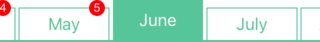

# PageMenuKitSwift

[PageMenuController](https://github.com/magickworx/PageMenuController) の Swift 版。

日本のニュース系アプリで使われている横スクロールのメニュー画面とそのコンテンツを表示するユーザインタフェースのクラス。
Xcode のプロジェクト一式を登録してあるので、実行すればシミュレータ上で動作確認が可能。

Swift3 で実装し直す際に、汎用的で拡張しやすいようにクラスを再設計した。ページメニューの見た目だけが違うので、スタイルごとに PMKPageMenuItem のサブクラスを実装し、それを利用する仕組みにした。よって、簡単にカスタムメニューを追加できる。

## How to use PageMenuKit.framework

Xcode の Build Target に PageMenuKitFatBinary を指定して Build を実行すると、PageMenuKit.framework が作成される。これを自作アプリの Xcode の Project で設定する。

あとは、以下のようなコードを記述して利用する。

```Swift
class RootViewController: UIViewController
{
  var pageMenuController: PMKPageMenuController? = nil

  override func viewDidLoad() {
    super.viewDidLoad()

    var controllers: [UIViewController] = []
    let dateFormatter = DateFormatter()
    for month in dateFormatter.monthSymbols {
      let viewController: DataViewController = DataViewController()
      viewController.title = month
      controllers.append(viewController)
    }

    let statusBarHeight: CGFloat = UIApplication.shared.statusBarFrame.size.height
    /*
     * Available menu styles:
     * .Plain, .Tab, .Smart, .Hacka, .Ellipse, .Web, .Suite, .NetLab and .NHK
     * See PMKPageMenuItem.swift in PageMenuKit folder.
     *
     * menuColors: [] means that we will use the default colors
     */
    pageMenuController = PMKPageMenuController(controllers: controllers, menuStyle: .Smart, menuColors: [], topBarHeight: statusBarHeight)
    self.addChildViewController(pageMenuController!)
    self.view.addSubview(pageMenuController!.view)
    pageMenuController?.didMove(toParentViewController: self)
  }
}
```

より詳細なコードは PageMenuKitDemo 内の RootViewController.swift を見てね。


## Available Menu Styles

### .Plain
[ニュースパス](https://itunes.apple.com/jp/app/id1106788059?mt=8) っぽいメニュー画面


### .Tab
[グノシー](https://itunes.apple.com/jp/app/id590384791?mt=8) っぽいメニュー画面


### .Smart
[SmartNews](https://itunes.apple.com/jp/app/id579581125?mt=8) っぽいメニュー画面


### .Hacka
[ハッカドール](https://itunes.apple.com/jp/app/id888231424?mt=8) っぽいメニュー画面



### .Ellipse
[JCnews](https://itunes.apple.com/jp/app/id1024341813?mt=8) っぽいメニュー画面


### .Web
[JCnews のウェブサイト](https://jcnews.tokyo/) っぽいメニュー画面


### .Suite
[NewsSuite](https://itunes.apple.com/jp/app/id1176431318?mt=8) っぽいメニュー画面（背景色はグラデーション）


### .NetLab
[ねとらぼ](https://itunes.apple.com/jp/app/id949325541?mt=8) っぽいメニュー画面（背景色は透明）


### .NHK
[NHK ニュース・防災](https://itunes.apple.com/jp/app/id1121104608?mt=8) っぽいメニュー画面


## Examples

PMKPageMenuController の initializer の menuColors に __[]__ を指定するとデフォルトの配色になる。ここでは、各スタイルごとに色を変更する例を示す。

### .Plain, .Hacka, .Ellipse, .NHK 

.Plain, .Hacka, .Ellipse, .NHK の各スタイルで指定できる色は一つだけである。
以下の例では .Plain スタイルに __紫（.purple）__ を設定している。

```swift
pageMenuController = PMKPageMenuController(controllers: controllers, menuStyle: .Plain, menuColors: [ .purple ], topBarHeight: statusBarHeight)
```
#### .Plain


#### .Hacka


#### .Ellipse


#### .NHK


### .Tab, .Smart

.Tab, .Smart スタイルで指定できる色は一つ以上である。
以下の例では .Tab スタイルに __赤、橙、黄、緑、青、紫__ を設定している。
メニューの数が配色した数よりも多い場合は、順に色が適用される。

```swift
pageMenuController = PMKPageMenuController(controllers: controllers, menuStyle: .Tab, menuColors: [ .red, .orange, .yello, .green, .blue, .purple ], topBarHeight: statusBarHeight)
```

#### .Tab


#### .Smart


### .Web

.Web スタイルも .Tab, .Smart スタイルと同様に指定できる色は一つ以上である。
ただし、背景色は現在固定されている。
また、現実装では最初に指定した色が境界線の色になる。

以下の例では .Web スタイルに __赤、橙、黄、緑、青、紫__ を設定している。
メニューの数が配色した数よりも多い場合は、順に色が適用される。

```swift
pageMenuController = PMKPageMenuController(controllers: controllers, menuStyle: .Web, menuColors: [ .red, .orange, .yello, .green, .blue, .purple ], topBarHeight: statusBarHeight)
```


### .Suite

.Suite スタイルで指定できる色は一つだけであるが、
現状ではインジケータの色が変更されるだけである。
以下の例では .Suite スタイルに __青（.blue）__ を設定している。

```swift
pageMenuController = PMKPageMenuController(controllers: controllers, menuStyle: .Suite, menuColors: [ .blue ], topBarHeight: statusBarHeight)
```


### .NetLab

.NetLab スタイルで指定できる色は一つだけである。
現状では、非選択時の文字色に影響する。
以下の例では .NetLab スタイルに __赤（.red）__ を設定している。

```swift
pageMenuController = PMKPageMenuController(controllers: controllers, menuStyle: .NetLab, menuColors: [ .red ], topBarHeight: statusBarHeight)
```


## Delegate Methods (optional)

ページの切り替え時に呼び出される Delegate を使うことも可能。

```swift
pageMenuController?.delegate = self
```

上記のような記述を追加して、必要に応じて以下のメソッドを実装してね。
現時点では、 **.Hacka** スタイルのバッジ表示の際に利用しているだけ。

```PMKPageMenuControllerDelegte.swift
public protocol PMKPageMenuControllerDelegate: class
{
  // ページ画面上でスワイプ操作による切り替えが行われる前に呼び出される
  func pageMenuController(_ pageMenuController: PMKPageMenuController, willMoveTo viewController: UIViewController, at menuIndex: Int)
  // ページの切り替えが完了した際に呼び出される
  func pageMenuController(_ pageMenuController: PMKPageMenuController, didMoveTo viewController: UIViewController, at menuIndex: Int)

  // メニュー項目の作成などが完了した際に呼び出される
  func pageMenuController(_ pageMenuController: PMKPageMenuController, didPrepare menuItems: [PMKPageMenuItem])
  // メニューがタップされた際に呼び出される
  func pageMenuController(_ pageMenuController: PMKPageMenuController, didSelect menuItem: PMKPageMenuItem, at menuIndex: Int)
}
```

## References

Qiita の[ニュース系アプリのユーザインタフェース PageMenuKit の実装](http://qiita.com/magickworx/items/5de63eb926a9447b2665) も見てね。カスタムメニューの実装方法についても書いてあるよ。

## Requirements

 - Swift 4
 - iOS 11.0 or later
 - Xcode 9.0 or later

## ToDo

 - .Suite と .Web と .NetLab スタイルのカスタマイズ方法

## License Agreement

Copyright (c) 2017, Kouichi ABE (WALL) All rights reserved.

Redistribution and use in source and binary forms, with or without
modification, are permitted provided that the following conditions are met:

 1. Redistributions of source code must retain the above copyright notice,
    this list of conditions and the following disclaimer.

 2. Redistributions in binary form must reproduce the above copyright notice,
    this list of conditions and the following disclaimer in the documentation
    and/or other materials provided with the distribution.

THIS SOFTWARE IS PROVIDED BY THE COPYRIGHT HOLDERS AND CONTRIBUTORS "AS IS"
AND ANY EXPRESS OR IMPLIED WARRANTIES, INCLUDING, BUT NOT LIMITED TO, THE
IMPLIED WARRANTIES OF MERCHANTABILITY AND FITNESS FOR A PARTICULAR PURPOSE ARE
DISCLAIMED. IN NO EVENT SHALL THE COPYRIGHT HOLDER OR CONTRIBUTORS BE LIABLE
FOR ANY DIRECT, INDIRECT, INCIDENTAL, SPECIAL, EXEMPLARY, OR CONSEQUENTIAL
DAMAGES (INCLUDING, BUT NOT LIMITED TO, PROCUREMENT OF SUBSTITUTE GOODS OR
SERVICES; LOSS OF USE, DATA, OR PROFITS; OR BUSINESS INTERRUPTION) HOWEVER
CAUSED AND ON ANY THEORY OF LIABILITY, WHETHER IN CONTRACT, STRICT LIABILITY,
OR TORT (INCLUDING NEGLIGENCE OR OTHERWISE) ARISING IN ANY WAY OUT OF THE USE
OF THIS SOFTWARE, EVEN IF ADVISED OF THE POSSIBILITY OF SUCH DAMAGE.

